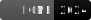

# AWESOME


This is the official code repository for:
### *Implicit Representations for Constrained Image Segmentation*
accepted at ICML 2024,

<p align="left">
    <a href="https://openreview.net/pdf?id=IaV6AgrTUp" alt="PDF File">
        </a>
    <a href="https://openreview.net/forum?id=IaV6AgrTUp" alt="OpenReview">
        </a>
    <a href="https://icml.cc/virtual/2024/poster/34423">
        
    </a>


</p>

<div class="teaser">
    
</div>


and:

### *Implicit Representations for Image Segmentation*

accepted in the UniReps Workshop at NeurIPS 2023.

<p align="left">
    <a href="https://openreview.net/pdf?id=LSSiDy7fG1" alt="PDF File">
        </a>
    <a href="https://openreview.net/forum?id=LSSiDy7fG1" alt="OpenReview Link">
        </a>
    <a href="https://unireps.org/2023/publication/schneider-2023-implicit/" alt="UniReps Link">
        </a>
</p>

<div align="center">
    
</div>


> AWESOME is a totally serious abbreviation for:
  "Anyone Working on Estimating Segmentations of Objects by Minimizing input-convex Energies".

### TL;DR

In this repository we show how to use shape constraints with *Implicit Representations* to enhance segmentation quality. Is the object, either convex, star-shaped, path-connected, periodic or symmetric in space or time, we show, how this information can be used to regularize any segmentation model or variational approach. One can use our method either as a post-processing step or as a constraint during training.

This can especially be useful if one has not much data at hand, the data is noisy, or existing segmentation models are not accurate or robust.

### Getting Started

To get started, please follow the [Getting Started guide](docs/getting_started.md) to set up the environment.

If you courious how the priors work, we have created short "how-to" notebooks for two of the priors:
- [Convexity](notebooks/how_to/convexity.ipynb)
- [Path-Connectedness](notebooks/how_to/path-connectedness.ipynb)

### Reproducability

Once the environment is set up, we explain in the [reproduction guide](docs/reproduction_guide.md) how to reproduce the results of the paper.

# Execution of the code

The training and evaluation of models can be archieved using seperate configurations and the `run.py` script within the scripts folder.

```bash

python scripts/run.py --config-path [Config-Path]

```

## Citation
If you use this code in your research, please cite our paper:

```bibtex
@inproceedings{
    schneider2024implicit,
    title={Implicit Representations for Constrained Image Segmentation},
    author={Schneider, Jan Philipp and Fatima, Mishal and Lukasik, Jovita and Kolb, Andreas and Keuper, Margret and Moeller, Michael},
    booktitle={41th International Conference on Machine Learning},
    year={2024},
    url={https://openreview.net/forum?id=IaV6AgrTUp}
}
```


If you have any doubts or just want to chat about the project, please [contact me](mailto://jan.schneider@uni-siegen.de?subject=AWESOME%20project)!

Best,

Philipp
